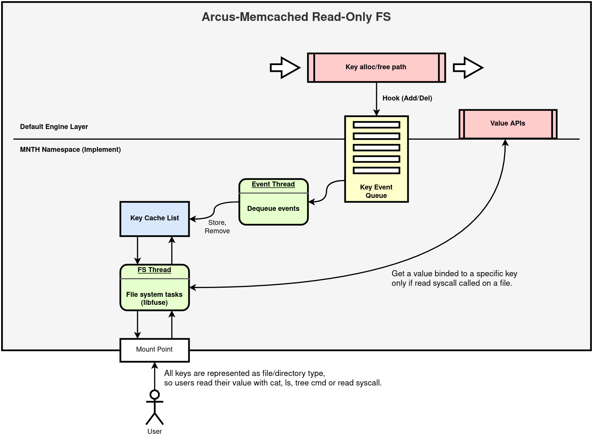

# Arcus-Memcached Read-Only FS
It is my toy project based on [arcus-memcached](https://github.com/naver/arcus-memcached) and [libfuse](https://github.com/libfuse/libfuse) for 2020 Contributhon (It's like GSoC).

### What is arcus-memcached?
It was born from memcached. But *Jam2In*, a company, customized the original one to support their own data structures, list, b+tree, map, and optimized. So basically, it is a NoSQL key-value in-memory cache server, but has different characteristics.

### libfuse?
It's a user-space file system framework. You may ask "what's the purpose of it?". Imagine that you want to build your own fs on your system. Without it, you are supposed to write down kernel side code, for instances, ready to kernel module, domain knowledge of fs interface, memory strategy, and so on. That'd take over a year to build a just prototype, moreover you may have to learn C language. libfuse takes all the things responsible for fs tasks inside the kernel. The only things you have to deal with are looking up the language interfaces and put your ideas on the code.

### arcus-memcached + libfuse?
I had an idea what if key-value pairs stored in the server could be read by POSIX `read` syscall but also using command-line tools, `ls`, `cat`, and so forth. That was where this project came.

# Architecture

Here are a few constraints to fulfill this project as the diagram,
1. The keys represented as files must have only `read` permission to ensure that all values binded to the keys are in good condition. *Not dirty*.
2. Use event queue mechanism not to get threads of default engine stuck in waiting for synchronous tasks such as lookup.

Once the server has made a mount point at a specific directory, all keys in the server are represented as files or directories only if they are for list data. After that, users can access and read values, they are data mapped to keys, with `cat`, `ls`, `tree`. Moreover, most programs can get the data through `read` syscall.

# Quick Demo (unfriendly)
### Requirements
1. libfuse (need to build)

### Build
Same as the way of building `arcus-memcached`, please see the official documents.

### Execute
```sh
$ sudo umount /tmp/mpoint; ./memcached -vvv -Z /tmp/mpoint

# List keys
$ ls /tmp/mpoint

# Get a value binded to a specific key
$ cat /tmp/mpoint/<key name>

# Get all values stored in the server
$ cat /tmp/mpoint/*

# List keys as a tree layout
$ tree /tmp/mpoint
```
I recommend you use [arcus-c-client](https://github.com/naver/arcus-c-client) to store values to the server.

# A behind story
I had attended the *Contributhon* two times for the last 4 years and this was the 3rd chance. At the beginning of the event, I wished to have different experiences compared to these years. Not just follow mentors and not just fill Pull Requests, but prefer to put something I didn't ever know together and into reality. It'd be good for me to smash the frame of my brain and see how both technologies work in detail.
